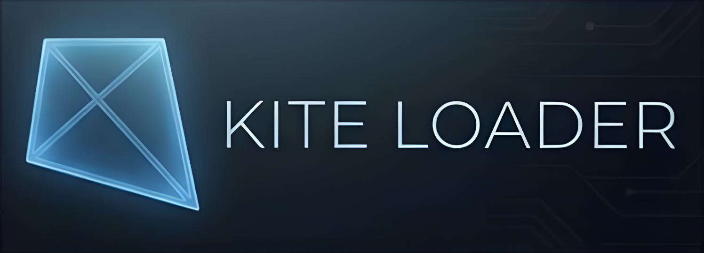

<p align="center">
  
</p>

<p align="center">
  <strong>Extend LuaTools with community mods — without modifying the core plugin.</strong><br>
  <em>Install mods, manage them from PowerShell, auto-update, and build your own.</em>
</p>

<p align="center">
  <a href="#-quick-start"></a>
  <a href="#-mod-development"></a>
  <a href="#-cli-reference"></a>
</p>

---

## ⚡ Quick Start

### One-Line Install

```powershell
irm https://raw.githubusercontent.com/nitaybl/luatools-modloader/main/install.ps1 | iex
```

Then install the mod loader onto your existing LuaTools:

```powershell
luatools install
```

That's it. Restart Steam and your mods are live.

### Install a Mod

```powershell
# From GitHub
luatools mod install https://github.com/someone/cool-mod

# From local folder
luatools mod install C:\path\to\my-mod

# List installed mods
luatools mod list

# Toggle mods on/off
luatools mod enable my-mod
luatools mod disable my-mod
```

---

## 🧩 How It Works

The mod loader installs **on top of** LuaTools as a lightweight layer. It adds two files:

| File | Location | Purpose |
|------|----------|---------|
| `mod_loader.js` | `public/` | Scans & executes mods in sandboxed scopes |
| `mod_loader.py` | `backend/` | Serves mod files to the frontend |

Mods live in `Steam/plugins/luatools/mods/`. Each mod is either:
- A **folder** with `manifest.json` + `mod.js` + optional `style.css`
- A **single `.js` file** for simple mods

**Core LuaTools is never modified.** Uninstalling the mod loader leaves LuaTools exactly as it was.

```
Steam/plugins/luatools/
├── public/
│   ├── luatools.js          ← untouched core
│   └── mod_loader.js        ← mod loader (removable)
├── backend/
│   ├── main.py              ← untouched core
│   ├── mod_loader.py        ← mod loader backend (removable)
│   └── mod_auto_update.py   ← auto-update checker (removable)
├── mods/                    ← your mods go here
│   ├── credits-mod/
│   │   ├── manifest.json
│   │   ├── mod.js
│   │   └── style.css
│   └── mods_config.json     ← enable/disable state
└── plugin.json
```

---

## 🔧 Mod Development

### manifest.json

```json
{
    "id": "my-awesome-mod",
    "name": "My Awesome Mod",
    "version": "1.0.0",
    "author": "YourName",
    "description": "Does something awesome",
    "main": "mod.js",
    "style": "style.css",
    "hooks": ["onOverlayOpen", "onFixApplied"],
    "repository": "https://github.com/you/my-awesome-mod",
    "minLuaToolsVersion": "7.1"
}
```

| Field | Required | Description |
|-------|----------|-------------|
| `id` | ✅ | Unique identifier (lowercase, hyphens ok) |
| `name` | ✅ | Display name |
| `version` | ✅ | SemVer version string |
| `author` | ✅ | Your name or username |
| `main` | ✅ | Entry JS file |
| `style` | ❌ | Optional CSS file |
| `hooks` | ❌ | Lifecycle hooks your mod uses |
| `repository` | ❌ | GitHub URL (enables auto-updates) |
| `minLuaToolsVersion` | ❌ | Minimum LuaTools version required |

### Lifecycle Hooks

```js
LuaToolsMods.registerMod({
    id: 'my-mod',
    version: '1.0.0',

    // Fired when the LuaTools fix overlay opens for a game
    onOverlayOpen: function(data) {
        // data.overlay - the DOM element
        // data.appid - Steam App ID
        // data.gameName - game name string
    },

    // Fired when overlay closes
    onOverlayClose: function(data) {},

    // Fired after a fix is successfully applied
    onFixApplied: function(data) {
        // data.appid, data.fixType
    },

    // Fired when a fix fails
    onFixFailed: function(data) {
        // data.appid, data.error
    },

    // Fired when LuaTools detects a Steam game page
    onGameDetected: function(data) {
        // data.appid, data.gameName
    },

    // Fired when a download begins
    onDownloadStart: function(data) {},

    // Fired when a download completes
    onDownloadComplete: function(data) {}
});
```

### Utility API

```js
// Inject custom CSS
LuaToolsMods.injectCSS('my-mod', '.my-class { color: cyan; }');

// Create a styled panel
var panel = LuaToolsMods.createPanel({
    id: 'my-panel',
    title: 'My Panel',
    content: '<p>Hello from my mod!</p>'
});
overlay.appendChild(panel);

// Show a toast notification
LuaToolsMods.showToast('Fix applied successfully!', 3000);

// Check registered mods
var allMods = LuaToolsMods.getMods();
var exists = LuaToolsMods.hasMod('some-mod-id');
```

### Auto-Updates for Your Mod

If your mod's `manifest.json` includes a `repository` field pointing to a GitHub repo, the mod loader will automatically check for newer releases. Tag your releases with SemVer versions (e.g., `v1.0.1`).

---

## 💻 CLI Reference

```
luatools <command> [arguments]

MODLOADER:
  install                    Install the mod loader onto LuaTools
  uninstall                  Remove the mod loader (keeps LuaTools intact)

MODS:
  mod install <url|path>     Install a mod from GitHub or local path
  mod remove <mod-id>        Uninstall a mod
  mod list                   List all installed mods
  mod enable <mod-id>        Enable a mod
  mod disable <mod-id>       Disable a mod

FIXES:
  fix apply <appid>          Request auto-fix for a Steam game

UTILITY:
  doctor                     Diagnose common issues
  version                    Show version info
  help                       Show help
```

---

## ⚠️ Important Disclaimers

> **USE AT YOUR OWN RISK.** This is an unofficial community project and is not affiliated with, endorsed by, or supported by Valve, Steam, or the original LuaTools developers.

> **NO WARRANTY.** This software is provided "as is", without warranty of any kind, express or implied. The authors are not responsible for any damage, data loss, or account issues that may result from using this software.

> **MOD SAFETY.** We do **NOT** review, verify, or guarantee the safety of third-party mods. Before installing any mod:
> - 🔍 **Always inspect the source code** before installing
> - 🛡️ **Scan files for malware** using your antivirus
> - ⚠️ **Only install mods from sources you trust**
> - 🚫 **Never install mods that ask for your credentials**

> **SUPPORT.** We are **not responsible** for providing support for third-party mods. If a mod breaks your setup, use `luatools mod disable <mod-id>` or `luatools uninstall` to revert.

---

## 🤝 Contributing

Want to share your mod with the community?

1. Create a GitHub repo for your mod
2. Include a proper `manifest.json` with all required fields
3. Tag releases with SemVer versions
4. Open an issue on this repo to get listed in the community mod directory

---

## 📄 License

MIT License. See [LICENSE](LICENSE) for details.

---
